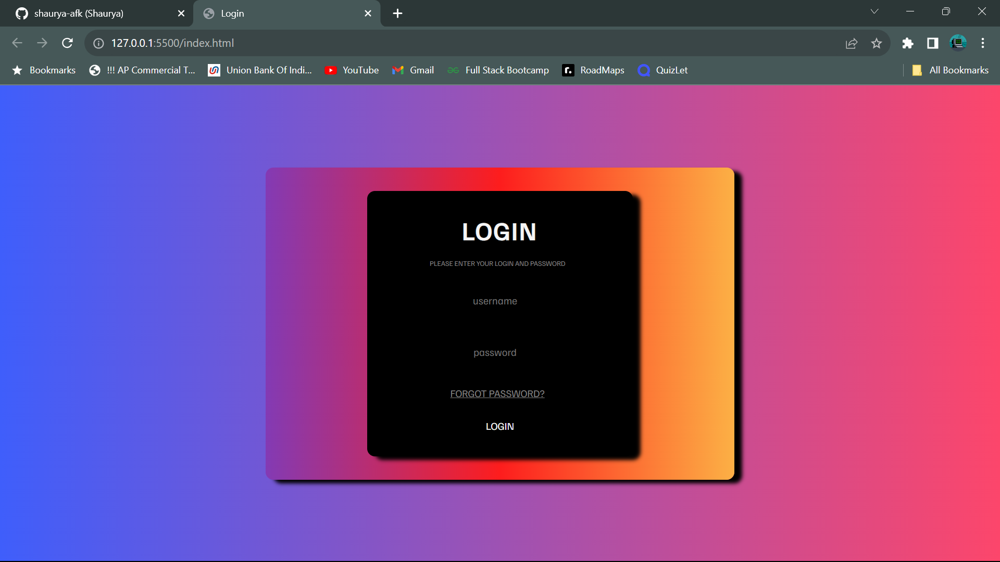

# Modern Minimalist Login Webpage

This project is a modern and minimalist login webpage created as a front-end project. It provides a clean and user-friendly interface for user authentication.

## Features

- Clean and minimalist design.
- User-friendly login form.
- Placeholder text for username and password fields.
- Login button with hover effect.

## Technologies Used

- HTML
- CSS

## Usage

1. Clone the repository to your local machine.
2. Open the `index.html` file in your web browser.

## Screenshots

## Contributing

If you'd like to contribute to this project, feel free to fork the repository and submit a pull request.

Thanks for checking out.😊
